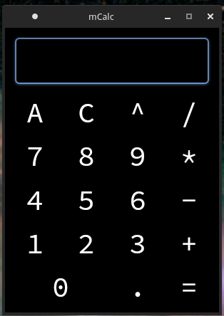
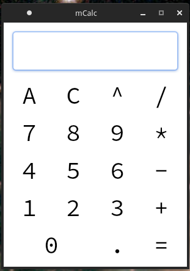

<h1> mCalc - modern calculator written in C++\Qt5 </h1>

App in active development  
Support operations:  
 - add
 - minus
 - multiply
 - divide
 - power
also work with real numbers

Has shortkeys:
 - 'C' -  clear 1 character from expression
 - 'A' - clear all
 - 'Q' - quit app

# Themes

|             Dark              |               Light           |
|:-----------------------------:|:-----------------------------:|
|  ||

# Author

lakeFm (Maks Makuta) 2021 (C)
